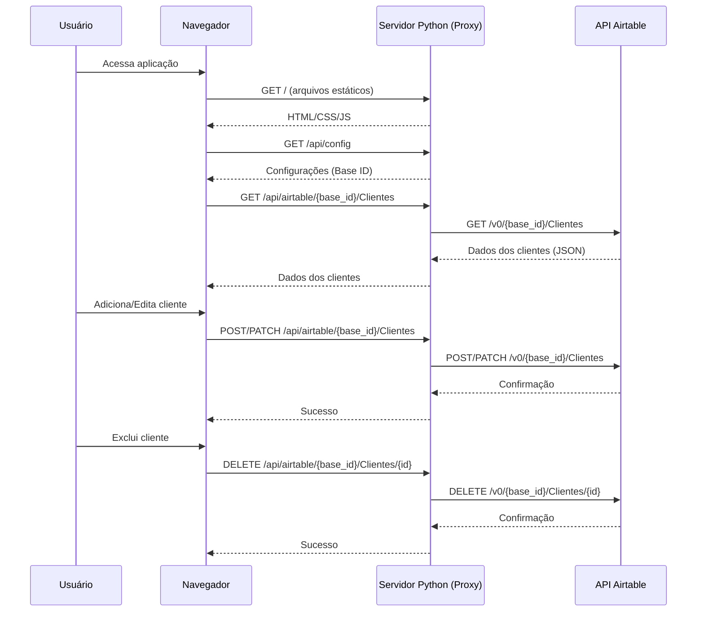

# CloudConnect
# 📋 Sistema de Cadastro de Clientes

## 🚀 Visão Geral

Sistema de gerenciamento de clientes single-page application (SPA) construído com vanilla JavaScript, HTML e CSS. Utiliza Airtable como banco de dados em nuvem e inclui um servidor proxy Python para resolver problemas de CORS.

## 📋 Pré-requisitos

- Python 3.7+
- Conta no [Airtable](https://airtable.com/)
- Navegador web moderno

## 🔧 Configuração das Variáveis de Ambiente

### 1. Obtenha as credenciais do Airtable

1. Acesse [airtable.com/create/api](https://airtable.com/create/api)
2. Crie uma nova base ou use uma existente
3. Crie uma tabela chamada `Clientes` com os campos:
   - `Nome` (Texto único)
   - `Email` (Email)
   - `Telefone` (Telefone)

4. Obtenha:
   - **Base ID**: Encontrado na URL da sua base: `https://airtable.com/appXXXXXXXXXXXXXX/...`
   - **API Key**: Gere em [airtable.com/account](https://airtable.com/account)

### 2. Configure as variáveis

**No Replit (Recomendado):**
```bash
# Nas Secrets do Replit (⚙️ -> Secrets)
AIRTABLE_API_KEY=seu_api_key_aqui
AIRTABLE_BASE_ID=seu_base_id_aqui
```

**Localmente (arquivo .env):**
```env
AIRTABLE_API_KEY=patJix2omRTtt05A1.b0a5d5666ee968773e3874b40474e750b4fe86a6aa1a1b745f78353f5f61d943
AIRTABLE_BASE_ID=appcKOxe8Gqark2T3
```

## 🏃‍♂️ Como Executar

### Opção 1: Usando o Servidor Python (Recomendado)

```bash
# Instale as dependências (se necessário)
# Não são necessárias dependências extras para o básico

# Execute o servidor
python3 server.py

# Acesse: http://localhost:5000
```

### Opção 2: Servidor Web Estático

```bash
# Se tiver o static-web-server instalado:
static-web-server --config static-web-server.toml

# Ou com python:
python3 -m http.server 8000
# Acesse: http://localhost:8000
```

## 🔄 Diagrama de Sequência - Fluxo de Conexão



## 🏗️ Estrutura do Projeto

```
/
├── index.html          # Página principal
├── style.css          # Estilos e animações
├── script.js          # Lógica da aplicação
├── server.py          # Servidor proxy Python
├── static-web-server.toml # Configuração do servidor
├── replit.md          # Documentação
└── .latest.json       # Controle de versão
```

## 🛠️ Funcionalidades

- ✅ Cadastro de clientes
- ✅ Listagem de clientes
- ✅ Edição de clientes
- ✅ Exclusão de clientes
- ✅ Validação de formulários
- ✅ Interface responsiva
- ✅ Animações suaves
- ✅ Modo escuro automático
- ✅ Tratamento de erros

## 🔍 Troubleshooting

### Problemas Comuns:

1. **Erro de CORS**: Use o servidor Python (`server.py`)
2. **API Key inválida**: Verifique se a chave está correta
3. **Base ID incorreto**: Confirme o ID da base no Airtable
4. **Tabela não encontrada**: Certifique-se que a tabela se chama `Clientes`

### Logs de Depuração:

```bash
# Verifique se as variáveis estão carregadas
python3 server.py
# Deve mostrar: "✅ Configurada" para ambas variáveis
```

## 📱 Acesso Remoto

Para acesso remoto (Replit ou similar), configure:

1. **Variáveis de ambiente** nas secrets
2. **Port forwarding** se necessário
3. **URL pública** para acesso externo

## 🚨 Importante

**NUNCA expose sua API Key publicamente!** Sempre use:
- Variáveis de ambiente
- Secrets do Replit
- Arquivos .env (no .gitignore)

## 📞 Suporte

Se encontrar problemas:
1. Verifique o console do navegador (F12)
2. Confirme as variáveis de ambiente
3. Teste a conexão com o Airtable
4. Verifique as permissões da API Key

O sistema está pronto para uso! 🎉
